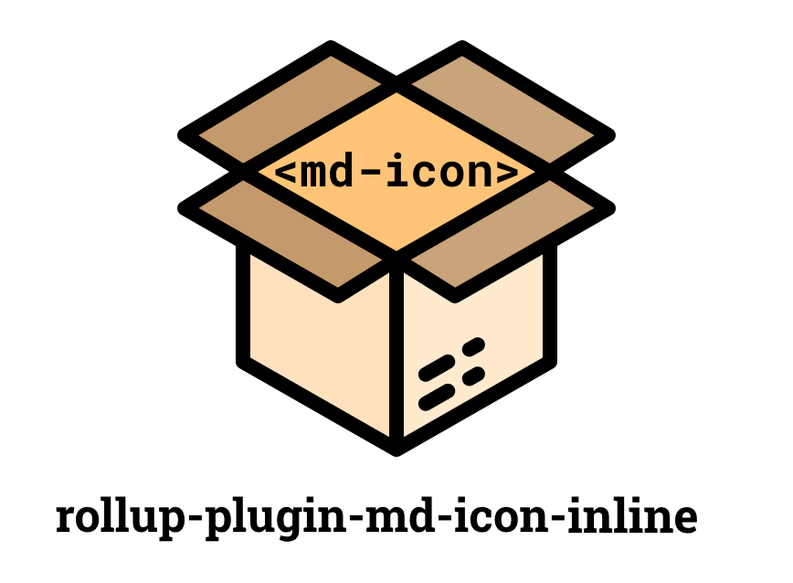

<div align="center">

</div>

#### Rollup plugin that inlines `<md-icon>` at build time.

So your final application doesn't have to rely on the material symbols font resource at runtime. There are many advantages:

- No FOUC (because the icons are directly available from your code.)
- No extra http requests.
- Works offline in a PWA.

```javascript
import {materialSymbols} from 'rollup-plugin-md-icon-inline';

// in your rollup config object
plugins: [materialSymbols()];
```

### Options

You can also specify options to get rid of the defaults :

```javascript
import {materialSymbols} from 'rollup-plugin-md-icon-inline';

materialSymbols({
	
});
```
